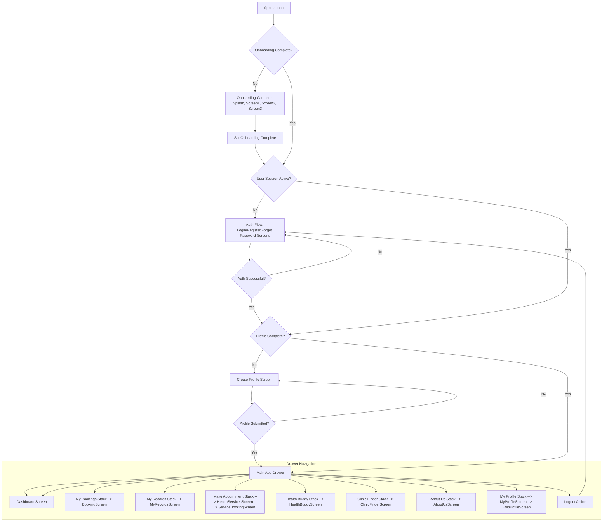
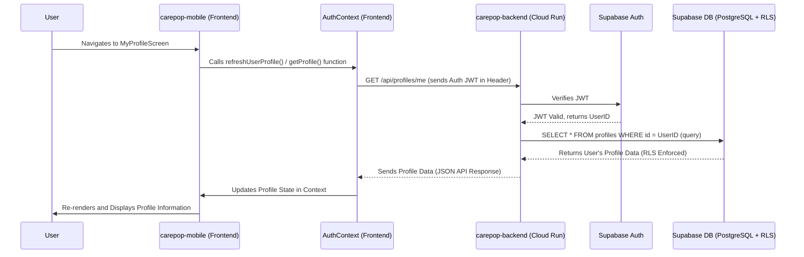

### CarePoP Native MobileApp & Backend: Beginner's Guide & Code Flow

**1. Project Overview**

The CarePoP platform is designed to improve healthcare access and management for diverse communities in Quezon City, with a special focus on the LGBTQIA+ community and other underserved populations. It aims to provide an inclusive, accessible, secure, and user-friendly experience.

The two main components we'll focus on are:

*   **`carepop-mobile`**: This is the application users install on their iOS or Android smartphones. Built with Expo (a framework on top of React Native), its primary purpose is to provide a mobile-friendly user interface for accessing CarePoP's services. Users can manage appointments, track health metrics, access their records, and find healthcare providers.
*   **`carepop-backend`**: This is the central "brain" of the CarePoP platform. It runs on servers (specifically Google Cloud Run, interacting with a Supabase-managed PostgreSQL database and authentication services). The backend is responsible for securely storing all user data, handling complex business logic (like matching users to services or processing bookings), and providing the necessary information to both the mobile app and the separate `carepop-web` application.

CarePoP's core values emphasize inclusivity, accessibility (especially for marginalized groups), robust security for sensitive health data, and a user-friendly design to ensure ease of use for everyone.

**2. Getting Started: Setting Up the Native App Locally**


To start developing and running the `carepop-mobile` app on your local machine, you'll need the following:

*   **Required Software (for Native App):**
    *   **Node.js:** (LTS version recommended) and its package manager, npm.
    *   **Git:** For version control.
    *   **Expo Go App:** Install this app on your physical iOS or Android device. It allows you to quickly run your app by scanning a QR code.
    *   **Alternatively for Emulation/Simulation:**
        *   **Android Studio:** With a configured Android Emulator (for testing on Android).
        *   **Xcode:** With a configured iOS Simulator (for testing on iOS, macOS only).
    *   **A Code Editor:** Visual Studio Code (VS Code) is highly recommended, with extensions for React Native, ESLint, and Prettier.
    *   **Note on Backend:** While you can work on many UI aspects of the `carepop-mobile` app without a locally running backend, you will need the `carepop-backend` to be operational (either running locally, or you're connected to a shared development/staging backend instance) to test features that involve API calls (e.g., login, fetching profile, booking appointments).

*   **Native App Installation (from the root of the Git repository):**
    1.  Open your terminal or command prompt.
    2.  Navigate to the `carepop-mobile` directory:
        ```bash
        cd carepop-mobile
        ```
    3.  Install the project dependencies:
        ```bash
        npm install
        ```
        (or `yarn install` if your project uses Yarn)

*   **Running the Native App (Development):**
    1.  Once dependencies are installed, start the Expo development server:
        ```bash
        npx expo start
        ```
    2.  This command will:
        *   Start the Metro Bundler, which bundles your JavaScript code.
        *   Open a new tab in your web browser with the Expo Developer Tools.
        *   Display a QR code in the terminal and in the browser.
    3.  To run the app:
        *   **On Expo Go (Physical Device):** Open the Expo Go app on your phone/tablet and scan the QR code.
        *   **On Android Emulator:** Press `a` in the terminal where Metro is running (if an emulator is already open and detected).
        *   **On iOS Simulator (macOS only):** Press `i` in the terminal (if a simulator is already open and detected).

*   **Backend Connection:**
    *   The mobile app needs to know where to find the Supabase backend. This is typically configured using environment variables.
    *   Look for a file like `.env.example` in the `carepop-mobile` directory. You'll likely need to create a `.env` file by copying it and filling in your specific Supabase URL and Anonymous Key.
        *   `EXPO_PUBLIC_SUPABASE_URL=your_supabase_project_url`
        *   `EXPO_PUBLIC_SUPABASE_ANON_KEY=your_supabase_anon_key`
    *   These keys allow the app to communicate with your Supabase instance for authentication and data.

**3. Project Folder Structure Overview**

*   **(Synthesized from standard structures, hints in Memory Bank, and provided project layout)**

Understanding the folder organization helps you find code quickly.

*   **`carepop-mobile/` (The Native Mobile App - Expo/React Native):**
    *   `src/`: This is where most of the application's source code lives.
        *   `screens/`: Contains components that represent distinct screens in the app (e.g., `DashboardScreen.tsx`, `LoginScreen.tsx`, `MyProfileScreen.tsx`). Each file typically exports a React component.
        *   `components/`: Houses reusable UI building blocks used across multiple screens (e.g., custom buttons, cards, input fields, `theme.ts`).
        *   `navigation/`: (Often integrated into `App.tsx` or a dedicated folder) Code responsible for setting up app navigation (e.g., stack navigators, drawer navigators using React Navigation).
        *   `context/`: For global state management. For example, `AuthContext.tsx` likely handles user authentication state and related functions (like login, logout, fetching profile).
        *   `utils/` or `lib/`: May contain utility functions, Supabase client initialization (`supabase.ts`), or helper modules.
        *   `assets/`: Static assets like images, custom fonts, etc.
    *   `app.json`: The main configuration file for your Expo project. It defines metadata like the app's name, icon, splash screen, supported platforms, and build settings.
    *   `.env`: (You create this, not committed to Git) Stores environment-specific variables like API keys.

*   **`carepop-backend/` (The Backend - Node.js/TypeScript on Cloud Run + Supabase):**
    *   `src/`: Contains the primary backend application code.
        *   `controllers/` or `routes/`: Defines the API endpoints (URLs). These files handle incoming HTTP requests, validate them, and then call appropriate service functions to do the work.
        *   `services/`: Contains the core business logic. Service functions interact with the Supabase database (e.g., fetching user data, creating new records), call third-party APIs, or perform complex calculations.
        *   `middleware/`: Contains functions that can intercept and process requests before they reach the main route handlers (e.g., for authentication checks like `SEC-BE-2`).
        *   `config/`: For backend configurations, such as initializing the Supabase client for backend use (often with a service role key).
        *   `types/`: TypeScript type definitions used across the backend.
        *   `utils/`: Shared utility functions, for example, an `encryptionService.ts` for application-level encryption (`SEC-E-2`).
    *   `supabase/`: Holds Supabase-specific configurations that are managed as code.
        *   `migrations/`: SQL files defining database schema changes (table creation, column additions, RLS policies).
        *   (Potentially `functions/` for Supabase Edge Functions, though Cloud Run is the primary compute here).
    *   `Dockerfile`: Instructions for Docker to build a container image of the backend application. This image is then deployed to Google Cloud Run.

**4. Core Frontend Concepts Explained Simply**

*   **(Expo, React Navigation, Supabase Client-Side interaction, Boilerplate)**
    *   **Expo:** Think of Expo as a helper that makes building React Native apps easier. It provides a set of tools and services that simplify development, building, and deploying your app. It handles a lot of the native configuration for you.
    *   **React Navigation:** This is the library used to manage how users move between different screens in the app. It allows you to define "stacks" of screens (like a deck of cards, where you can go forward or back), "drawers" (menus that slide out from the side), and "tabs." You use functions like `navigation.navigate('ScreenName')` to move to a new screen. (See `App.tsx`).
    *   **Supabase Client-Side Interaction:** The mobile app directly communicates with Supabase for certain tasks, primarily authentication (login, signup, logout) and sometimes for simple data fetching/subscriptions if RLS is sufficient. This is done using the Supabase JavaScript SDK (`@supabase/supabase-js`), which is initialized in a file like `src/utils/supabase.ts`.
    *   **Boilerplate:** This refers to standard code sections or structures that are common in many apps. For instance, setting up navigation, context providers (`AuthProvider` in `App.tsx`), or theme configuration are often part of the initial boilerplate.

**5. Core Backend Concepts Explained Simply**

*   **(Synthesized from `systemPatterns.md`, `techContext.md`)**

    *   **What is a REST API?**
        A REST API (Representational State Transfer Application Programming Interface) is like a menu for the backend. The backend provides a list of specific URLs (called "endpoints," e.g., `/api/users`, `/api/appointments`). The mobile app can "call" these URLs over the internet to:
        *   **GET data:** (e.g., ask for a user's profile).
        *   **POST data:** (e.g., send information to create a new appointment).
        *   **PUT data:** (e.g., send information to update an existing user profile).
        *   **DELETE data:** (e.g., tell the backend to cancel an appointment).
        The backend processes the request and sends back a response, usually in a format called JSON.

    *   **What is Google Cloud Run?**
        This is a service from Google Cloud where the `carepop-backend` code (written in Node.js with TypeScript) actually runs. Instead of managing servers yourself, you package your backend code into a "container" (using the `Dockerfile`) and give it to Cloud Run. Cloud Run then automatically runs your code, and it can scale up (run more copies) if many users are using the app, or scale down if there's less traffic. It's ideal for running custom backend logic that isn't directly handled by Supabase itself.

    *   **How the Backend Uses Supabase:**
        The backend code running on Cloud Run heavily relies on Supabase. It uses the Supabase JavaScript SDK (just like the frontend, but configured differently for backend use) to:
        *   **Connect to Supabase PostgreSQL Database:** This is where all the application data (user profiles, appointments, health records, etc.) is stored. The backend services read from and write to this database.
        *   **Interact with Supabase Auth:** For certain operations, especially those requiring administrative privileges or bypassing RLS in a controlled manner (like creating a user's initial profile record after they sign up via the frontend), the backend might use a special, highly privileged `service_role` key to interact with Supabase Auth or directly manipulate user-related data.

    *   **What is Supabase RLS (Row Level Security)?**
        RLS is a powerful security feature built directly into the Supabase PostgreSQL database. It's like setting up specific rules on each data table that dictate *who* can see or modify *which rows* of data. For example, an RLS policy on the `profiles` table might say, "A user can only see their own profile row." Even if the backend code tries to fetch all profiles, RLS will automatically filter the results to only include data the currently authenticated user is allowed to access. This is a fundamental security layer.

    *   **What is Application-Level Encryption (ALE)?**
        For extremely sensitive information (e.g., specific health tracking details, as might be referenced by `SEC-E-2` in your system patterns), CarePoP employs an additional layer of security called Application-Level Encryption.
        1.  Before saving this sensitive data to the Supabase database, the `carepop-backend` code first encrypts (scrambles) it using a secret encryption key.
        2.  The scrambled, unreadable data is then stored in Supabase.
        3.  When the app needs to display this data, the backend fetches the scrambled data, and then uses the secret key to decrypt (unscramble) it back into a readable format *before* sending it to the mobile app.
        This means that even if someone somehow gained access to the raw database, the most sensitive fields would still be encrypted. The encryption/decryption logic likely resides in a utility like `src/utils/cryptoService.ts` in the backend.

    *   **What is the `service_role` key?**
        This is a special API key for Supabase that has full administrative access to your Supabase project, meaning it can bypass RLS policies. It is **CRITICALLY IMPORTANT** that this key is kept secret and is **NEVER** used in the frontend (mobile or web app). The `carepop-backend` (running on Cloud Run) uses this key *only* in very specific, controlled situations where it needs to perform actions that RLS would normally restrict, such as creating a user's profile entry after they've authenticated, or for other system-level tasks. Any backend code using the `service_role` key must have its own robust authorization checks to ensure the original user requesting the action actually has permission to do so (as per `SEC-BE-3`).

**6. Application Navigation Flow (Native App - The "Map")**

*   **(Based on `App.tsx` and standard app flows)**

The user's journey through the `carepop-mobile` app typically follows this flow:



1.  **App Launch & Splash Screen:** User opens the app. A splash screen (`screens/Onboarding/SplashScreen.tsx`) is shown briefly while initial assets and fonts load.
2.  **Onboarding (First Time Users):** If it's the user's first time (or `hasOnboarded` flag in AsyncStorage is false), they are shown an onboarding carousel (`OnboardingScreenOne.tsx`, `Two.tsx`, `Three.tsx`). Completing onboarding sets the flag and proceeds.
3.  **Authentication Check (`AuthProvider` in `App.tsx`):**
    *   The app checks if there's an active user session with Supabase.
4.  **Auth Flow (If No Session or Profile Incomplete):**
    *   **Login Screen (`screens/LoginScreen.tsx`):** If no session, the user is directed here to log in with their credentials.
    *   **Register Screen (`screens/RegisterScreen.tsx`):** Users can navigate here from Login to create a new account.
    *   **Forgot Password Screen (`screens/ForgotPasswordScreen.tsx`):** For password recovery.
    *   **Create Profile Screen (`screens/CreateProfileScreen.tsx`):** If a user has a session but their profile is incomplete (e.g., missing `first_name`), they are navigated here to complete their profile details. This is crucial for app functionality.
5.  **Main App Flow (If Session Exists and Profile is Complete):**
    *   The user is navigated to the main part of the app, which is structured with a Drawer Navigator (`MainAppDrawer` in `App.tsx`).
    *   **Dashboard (`screens/DashboardScreen.tsx`):** Typically the default screen. Shows a welcome message, an overview of upcoming appointments, quick access to health services, and a health snapshot. Navigation to other sections often starts here.
    *   **Drawer Menu Items:** (as illustrated in the chart above)
        *   **Dashboard:** Navigates to `DashboardScreen`.
        *   **My Bookings:** Navigates to a stack leading to `screens/BookingScreen.tsx` (currently a placeholder) to view and manage appointments.
        *   **My Records:** Navigates to `src/screens/MyRecordsScreen.tsx` (currently a placeholder) for accessing health records.
        *   **Make Appointment:** Navigates to `src/screens/HealthServicesScreen.tsx` (placeholder) to start the booking process, which then likely goes to `src/screens/ServiceBookingScreen.tsx` (placeholder).
        *   **Health Buddy:** Navigates to `src/screens/HealthBuddyScreen.tsx` for health tracking features (Pill Tracker, Menstrual Cycle, Activity, Blood Pressure, Insights).
        *   **Clinic Finder:** Navigates to `src/screens/ClinicFinderScreen.tsx` (placeholder) to find nearby clinics.
        *   **About Us:** Navigates to `src/screens/AboutUsScreen.tsx` displaying information about FPOP.
        *   **My Profile (in custom drawer bottom):** Navigates to a stack leading to `src/screens/MyProfileScreen.tsx` to view and edit user profile details (`src/screens/EditProfileScreen.tsx`).
        *   **Logout (in custom drawer bottom):** Signs the user out via `AuthContext` and returns them to the Auth Flow (Login Screen).
    *   Navigation between these screens is handled by `navigation.navigate('ScreenNameOrRouteKey', { params_if_any })` calls within the screen components.

**7. Frontend-Backend Interaction Example: Fetching User Profile**

*   **(Synthesized from typical app flow and potential Epics/Tickets like PROF-2)**

Let's trace how the `MyProfileScreen` might fetch and display the user's profile information:



1.  **Navigation:** User opens the drawer and taps "My Profile." React Navigation takes them to the `MyProfileScreen` component in `carepop-mobile`.
2.  **Data Fetch Trigger:** Inside `MyProfileScreen.tsx`, a `useEffect` hook might run when the screen loads. This hook calls a function, possibly from `AuthContext.tsx` (e.g., `refreshUserProfile()` or a dedicated `getProfile()` function), to get the latest profile data.
3.  **API Request (Frontend to Backend):**
    *   The function in `AuthContext` (or a service file) constructs an HTTP GET request to a backend API endpoint, for example: `GET https://your-cloud-run-url.a.run.app/api/profiles/me`.
    *   Crucially, it includes the user's Supabase Auth JWT (JSON Web Token) in the `Authorization` header of the request (e.g., `Authorization: Bearer <jwt_token>`). This token was obtained when the user logged in.
4.  **Request Received (Backend):** The `carepop-backend` application running on Google Cloud Run receives this incoming request.
5.  **Authentication Middleware (Backend):**
    *   A middleware function (as per `SEC-BE-2`, likely configured in `src/middleware/` or at the router level) intercepts the request.
    *   It extracts the JWT from the header and uses Supabase's backend SDK to verify its authenticity and get the associated user ID (`auth.uid()`). If the token is invalid or expired, the middleware rejects the request with an unauthorized error (e.g., 401).
6.  **Controller & Service Logic (Backend):**
    *   If authentication is successful, the request is passed to the relevant controller/route handler (e.g., in `src/controllers/profileController.ts`).
    *   The controller calls a service function (e.g., in `src/services/profileService.ts`) to handle the business logic.
    *   This service function uses the Supabase JS SDK (now aware of the authenticated user's ID) to query the `profiles` table in the PostgreSQL database (e.g., `supabase.from('profiles').select('*').eq('id', userId).single()`).
7.  **RLS Enforcement (Database):** Supabase's Row Level Security policies on the `profiles` table ensure that the query *only* returns the profile row matching the authenticated user's ID. It cannot access other users' profiles.
8.  **Response (Backend to Frontend):** The backend service function receives the profile data from Supabase. If application-level encryption was used for any fields, they would be decrypted here. The controller then formats this data (usually as JSON) and sends it back as the HTTP response to the mobile app.
9.  **Data Received & Display (Frontend):**
    *   The `carepop-mobile` app (specifically, the `fetch` or `axios` call in `AuthContext`) receives the JSON response.
    *   The data is then used to update the state within `AuthContext` (which holds the `profile` object).
    *   The `MyProfileScreen`, which consumes `AuthContext` via `useAuth()`, re-renders automatically and displays the fetched profile information (name, email, etc.) in the UI.
10. **Error Handling:** If any step fails (network error, backend error like 500, unauthorized 401), the frontend code should catch the error and display an appropriate message to the user (e.g., "Could not load profile. Please try again.").

**8. Key Feature Logic Location (High-Level)**

*   **Frontend (`carepop-mobile/`):**
    *   **User Interface (UI) & Screen-Specific Logic:** Primarily in `src/screens/`. Each screen component manages its own layout and local state.
    *   **Reusable UI Elements:** `src/components/`.
    *   **Navigation Setup:** `App.tsx` (contains `RootStack`, `AuthStackNav`, `MainAppDrawer`, etc.).
    *   **Global State & Core API Interactions (Auth, Profile):** `src/context/AuthContext.tsx`.
    *   **Supabase Client Initialization:** `src/utils/supabase.ts`.
    *   **Styling and Theme:** `src/components/theme.ts` (or a dedicated `src/theme/` folder).

*   **Backend (`carepop-backend/`):**
    *   **API Endpoint Definitions & Request Handling:** `src/controllers/` or `src/routes/`.
    *   **Core Business Logic & Supabase Database Interactions:** `src/services/`. This is where most of the "work" happens (e.g., creating a booking, fetching complex data).
    *   **Authentication/Authorization Middleware:** `src/middleware/`.
    *   **Database Schema, Triggers, RLS Policies:** Defined in SQL files within `supabase/migrations/` and also viewable/manageable via the Supabase Dashboard.
    *   **Application-Level Encryption Utilities:** Likely in a file such as `src/utils/cryptoService.ts` (if `SEC-E-2` is implemented).
    *   **Background/Scheduled Job Logic:** If the application has tasks that run periodically (e.g., sending reminders), this logic might be in a `src/jobs/` directory or triggered by external schedulers calling specific endpoints.

**9. Tips for Getting Started Exploring**

*   **Start with `App.tsx` in `carepop-mobile`:** Understand how the main navigators (Root, Auth, Drawer) are structured. This is the skeleton of the app.
*   **Pick a Simple Screen:** Choose a screen like `MyProfileScreen.tsx` or `AboutUsScreen.tsx`. Examine how it gets its data (if any) and how it's laid out.
*   **Trace an API Call:**
    *   Find a place in the frontend that makes an API call (e.g., login in `AuthContext.tsx` or profile fetching).
    *   Look at the URL it calls.
    *   Then, go to the `carepop-backend` project and find the corresponding route/controller that handles that URL.
    *   Follow the logic from the controller to the service to see how it interacts with Supabase.
*   **Explore `AuthContext.tsx`:** This context is central to user authentication and profile management in the frontend.
*   **Look at Supabase Migrations:** The files in `carepop-backend/supabase/migrations/` define the database tables and RLS policies. This helps understand the data structure.
*   **Don't Be Afraid to `console.log()`:** When trying to understand data flow, adding temporary `console.log` statements in both frontend and backend code can be very helpful.
*   **Read the Memory Bank:** Continuously refer back to the project's Memory Bank files (`epics_and_tickets.md` for feature details, `systemPatterns.md` for architectural decisions, etc.) as they are your primary source of truth for this specific project. 